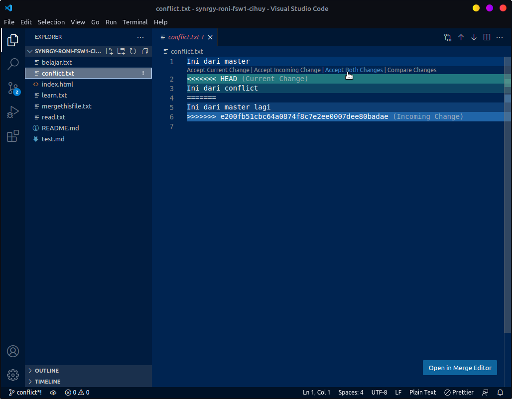
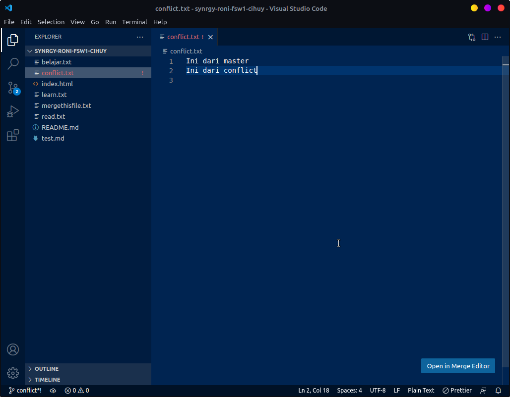
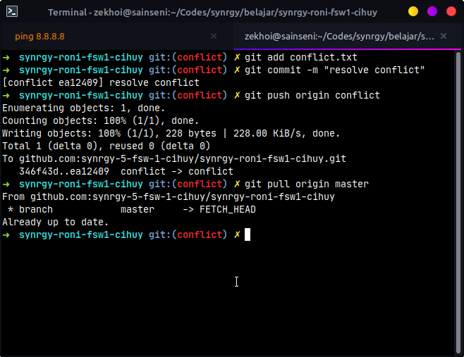
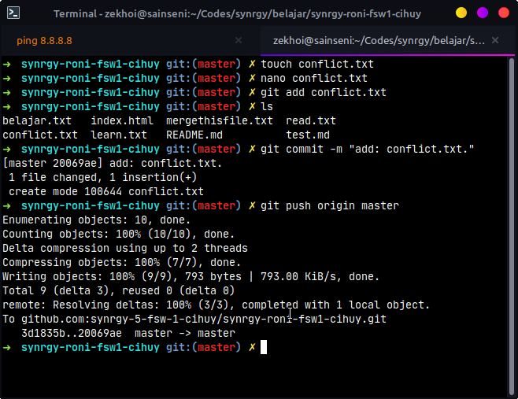
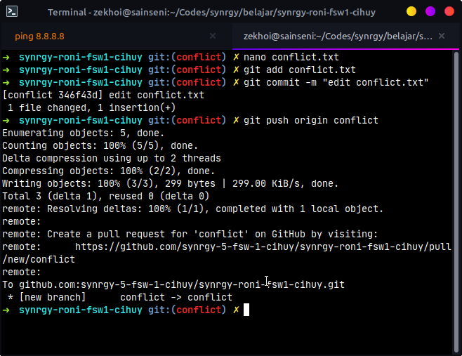
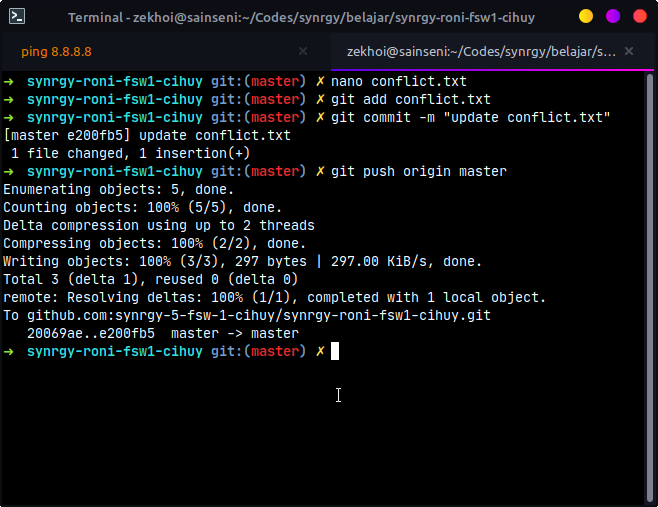
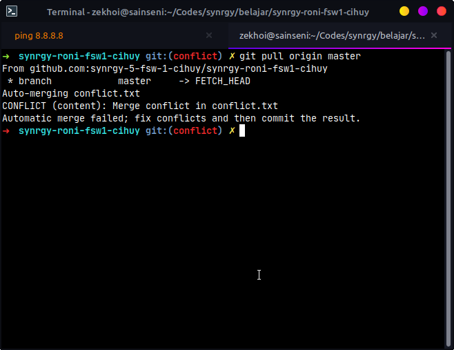

# CONFLICT

## Alur

Misalkan saya membuat file baru bernama `conflict.txt` pada branch `master` kemudian saya ingin membuat conflict terhadap file yang sama pada branch `conflict`

- Membuat file `conflict.txt` pada branch `master` dengan isi :

```
Ini dari master
```

- Melakukan add file pada branch `master`
- Melakukan commit pada branch `master`
- Melakukan push pada branch `master`
- Membuat branch baru bernama `conflict`
- Mengedit file `conflict.txt` pada branch `conflict` menjadi :

```
Ini dari master
Ini dari conflict
```

- Melakukan add file pada branch `conflict`
- Melakukan commit file pada branch `conflict`
- Melakukan push pada branch `conflict`
- Mengganti current branch ke `master`
- Mengedit file `conflict.txt` pada branch `master` menjadi :

```
Ini dari master
Ini dari master lagi
```

- Melakukan add file pada branch `master`
- Melakukan commit pada branch `master`
- Melakukan push pada branch `master`

- Mengganti current branch ke `conflict`
- Mengganti melakukan pull ke `master`

### Membuat file `conflict.txt` pada branch `master`

Membuat file `conflict.txt`

```bash
touch conflict.txt
```

Mengedit file `conflict.txt`

```bash
nano conflict.txt
```

Isi file `conflict.txt`

```
Ini dari master
```

### Melakukan add file pada branch `master`

```
git add conflict.txt
```

### Melakukan commit pada branch `master`

```
git commit -m "add: conflict.txt"
```

### Melakukan push pada branch `master`

```
git push origin master
```

### Membuat branch baru bernama `conflict`

```
git checkout -b conflict
```

### Mengedit file `conflict.txt` pada branch `conflict`

Mengedit file `conflict.txt`

```bash
nano conflict.txt
```

Isi file `conflict.txt`

```
Ini dari master
Ini dari conflict
```

### Melakukan add file pada branch `conflict`

```
git add conflict.txt
```

### Melakukan commit pada branch `conflict`

```
git commit -m "edit conflict.txt"
```

### Melakukan push pada branch `conflict`

```
git push origin conflict
```

### Mengganti current branch ke `master`

```
git checkout master
```

### Mengedit file `conflict.txt` pada branch `master`

Mengedit file `conflict.txt`

```bash
nano conflict.txt
```

Isi file `conflict.txt`

```
Ini dari master
Ini dari master lagi
```

### Melakukan add file pada branch `master`

```
git add conflict.txt
```

### Melakukan commit pada branch `master`

```
git commit -m "add: conflict.txt"
```

### Melakukan push pada branch `master`

```
git push origin master
```

### Mengganti current branch ke `conflict`

```
git checkout conflict
```

### Melakukan pull ke branch `master`

```
git pull origin master
```

Kemudian conflict pun terjadi

# Solve

## Accept both changes



## Mengedit file conflict menjadi yang diinginkan

Misal isi file menjadi `conflict.txt` seperti di bawah ini saja

```
Ini dari master
Ini dari conflict
```

atau menjadi

```
Ini dari master
Ini dari conflict
Ini dari master lagi
```



### Melakukan Add, Commit, Push ke branch `conflict` serta Pull ke `master`

Melakukan Add, Commit, Push ke branch `conflict` dan memastikan tidak ada conflict lagi dengan melakukan pull ke branch master

### Melakukan add file pada branch `conflict`

```
git add conflict.txt
```

### Melakukan commit pada branch `conflict`

```
git commit -m "resolve conflict"
```

### Melakukan push pada branch `conflict`

```
git push origin conflict
```

### Melakukan pull ke branch `master`

```
git pull origin master
```



## Ilustrasi

Inisialisasi file `conflict.txt` pada branch `master`



Mengedit file `conflict.txt` pada branch `conflict`



Mengedit file `conflict.txt` pada branch `master`



Melakukan pull ke branch `master`


