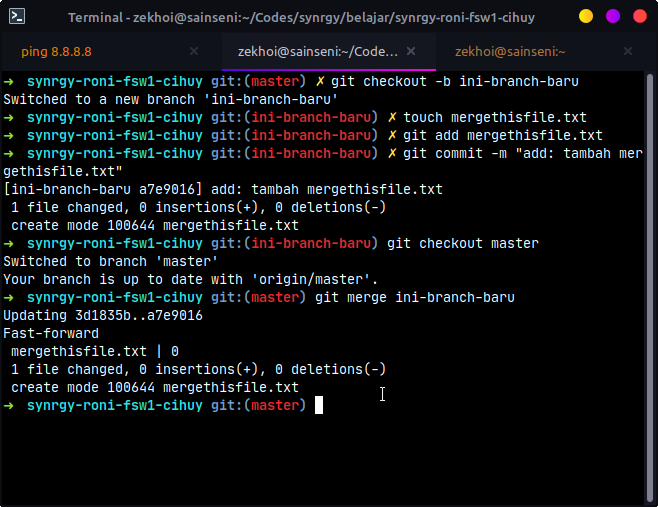

# MERGE

## Alur

Misalkan saya membuat file baru bernama `mergethisfile.txt` pada branch `ini-branch-baru` kemudian saya ingin merge master dengan branch baru

- Membuat branch baru bernama `ini-branch-baru`
- Membuat file baru `mergethisfile.txt` pada branch baru
- Melakukan add file
- Melakukan commit
- Kembali ke branch `master`
- Melakukan merging

### Membuat Branch Baru

```
git checkout -b ini-branch-baru
```

### Membuat File Baru

Menggunakan terminal

```
touch mergethisfile.txt
```

Bisa menggunakan cara biasa seperti klik kanan new file, dsb.

### Melakukan Add

```
git add mergethisfile.txt
```

### Melakukan Commit

```
git commit -m "add: tambah mergethisfile.txt"
```

### Kembali ke branch master

```
git checkout master
```

### Melakukan merge dari branch master

```
git merge ini-branch-baru
```

## Ilustrasi


