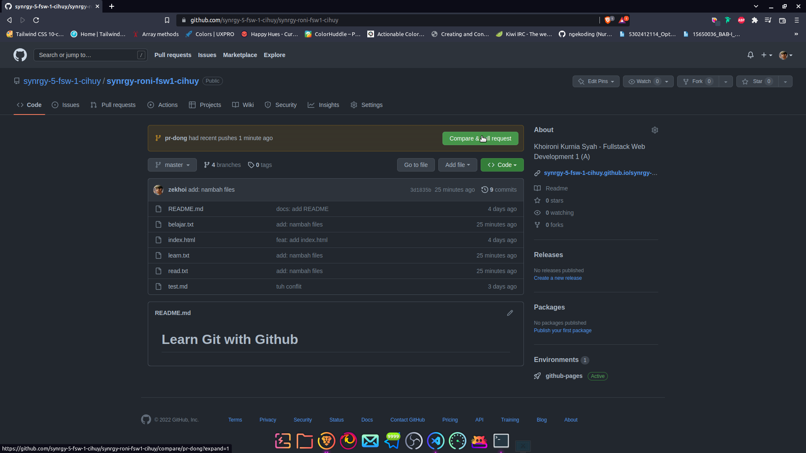
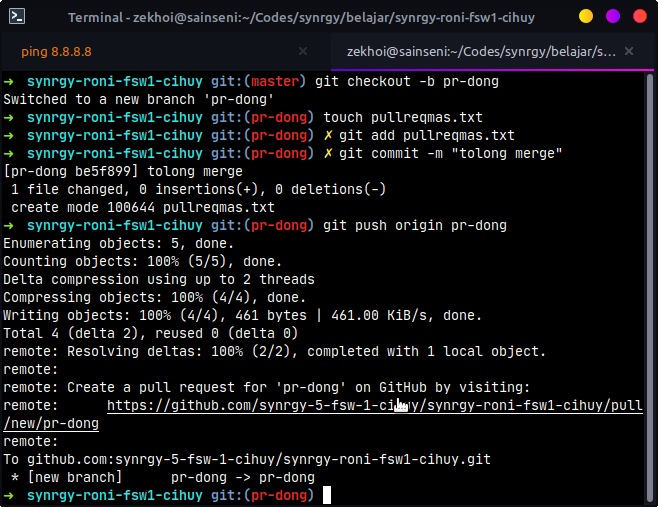

# PULL REQUEST

## Alur

Misalkan saya membuat file baru bernama `pullreqmas.txt` pada branch `pr-dong` kemudian saya ingin Pull Request untuk branch baru

- Membuat branch baru bernama `pr-dong`
- Membuat file baru `pullreqmas.txt` pada branch baru
- Melakukan add file
- Melakukan commit
- Melakukan push ke branch `pr-dong`
- Melakukan Pull Request di Github

### Membuat Branch Baru

```
git checkout -b pr-dong
```

### Membuat File Baru

Menggunakan terminal

```
touch pullreqmas.txt
```

Bisa menggunakan cara biasa seperti klik kanan new file, dsb.

### Melakukan Add

```
git add pullreqmas.txt
```

### Melakukan Commit

```
git commit -m "tolong merge"
```

### Melakukan Push ke branch

```
git push origin pr-dong
```

### Melakukan Pull Request

Mengunjungi link repository yang dituju



Melakukan Pull Request


Pull Request berhasil diminta


## Ilustrasi


