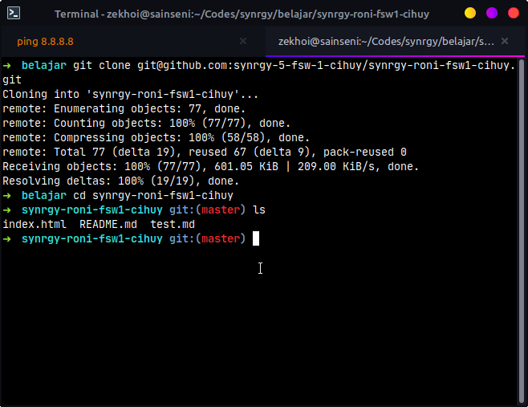
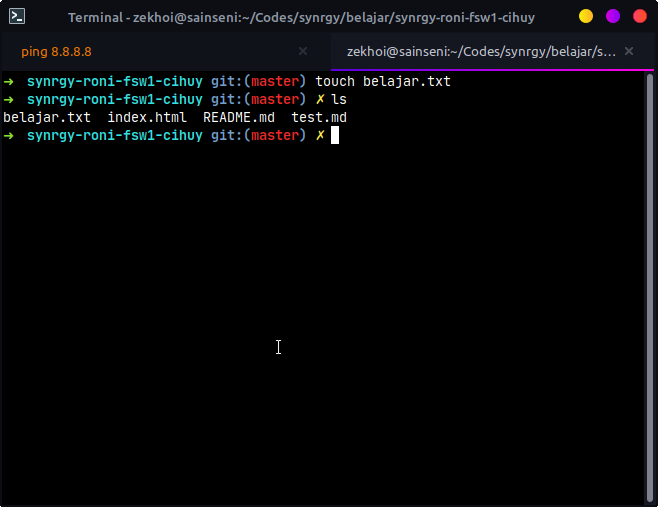
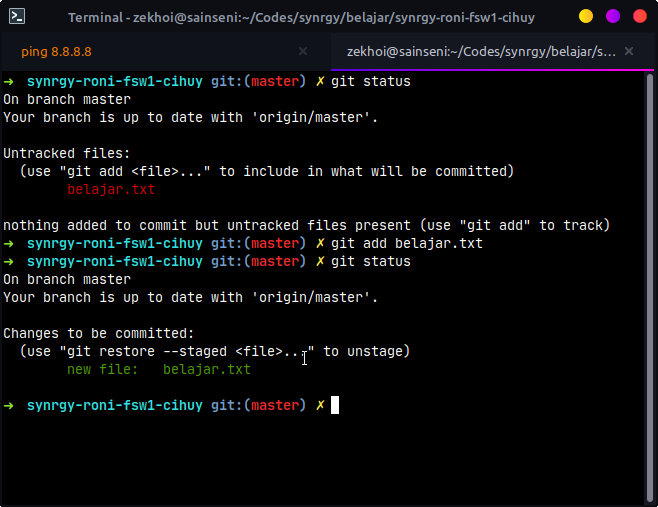
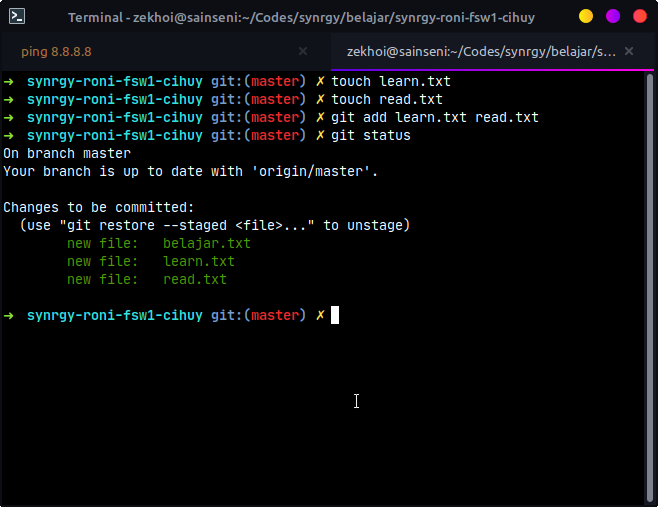
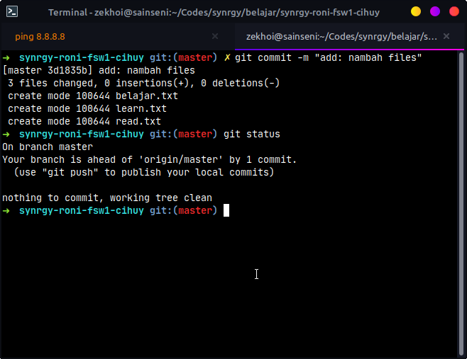
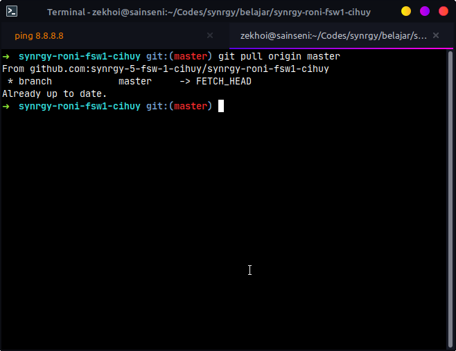
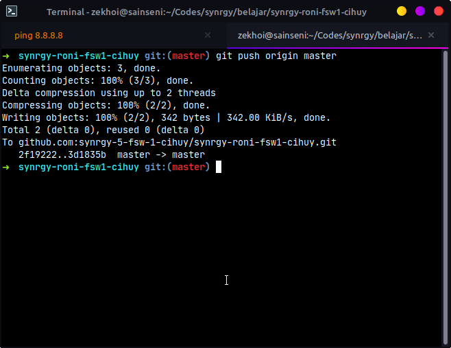
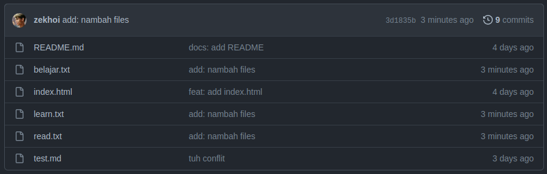
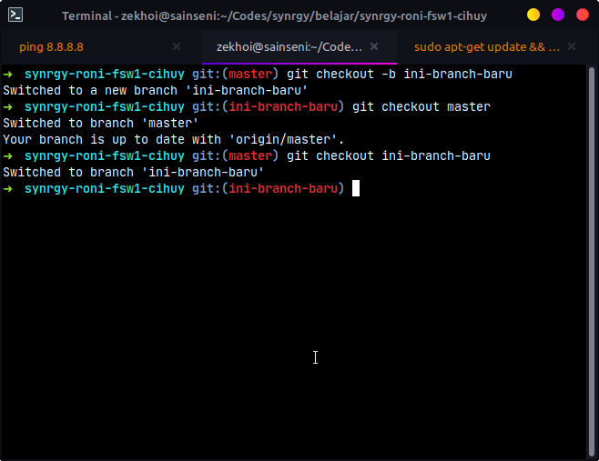

# Belajar Git

## Melakukan Clone

```
git clone url-repo
```

Contoh:

```
git clone git@github.com:synrgy-5-fsw-1-cihuy/synrgy-roni-fsw1-cihuy.git
```

atau

```
git clone https://github.com/synrgy-5-fsw-1-cihuy/synrgy-roni-fsw1-cihuy.git
```



## Melakukan Add

```
git add filename
```

Misalkan saya ingin melakukan perubahan berupa penambahan file bernama `belajar.txt`



Contoh :
Untuk single file

```
git add belajar.txt
```

Untuk multiple files

```
git add belajar.txt
```

Untuk semua file

```
git add .
```

Single file



Multiple files



## Melakukan Commit

```
git commit -m "message here"
```

Contoh :

```
git commit -m "add: nambah files"
```



Contoh :

## Melakukan Pull

```
git pull origin branch-name
```

Contoh :

```
git pull origin master
```



## Melakukan Push

```
git push origin branch-name
```

Contoh :

```
git pull origin master
```




## Branch

Membuat branch baru

```
git checkout -b branch-name
```

Mengganti current branch ke branch lain

```
git checkout branch-name
```

Contoh :

```
git checkout ini-branch-baru
```



## Merge

```
git merge branch-name
```

Baca di [MERGE](./MERGE.md)

## Pull Request

Baca di [CONFLICT](./CONFLICT.md)

# Conflict Schema

Baca di [CONFLICT](./CONFLICT.md)
