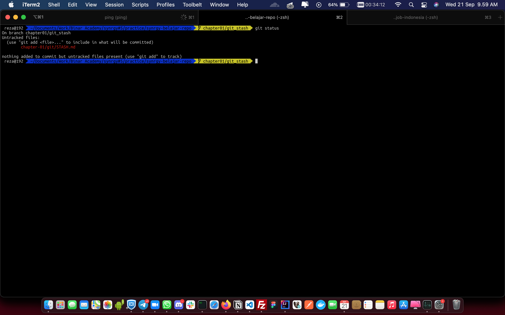
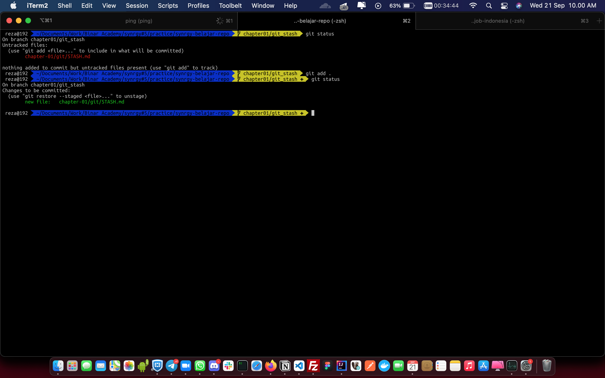
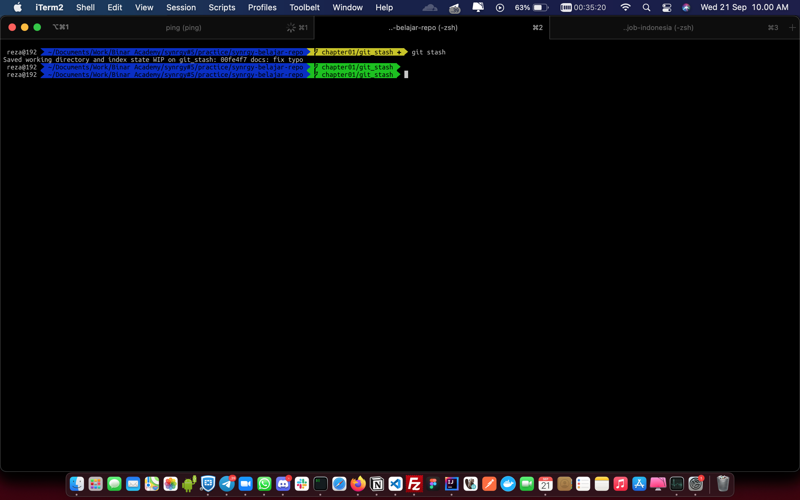
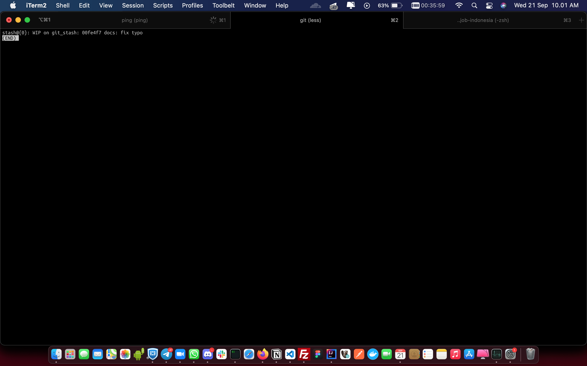
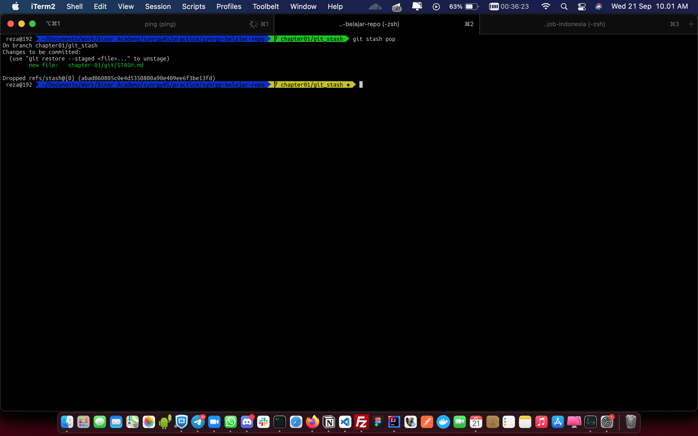

# STASH

# Workflow
Stash adalah sebuah function di git untuk melakukan saving sementara perubahan kita di local ketika lupa pulling

# Command
## Checking local changes
Sebelum melakukan proses stashing changes, kita perlu melakukan checking changes di local kita dengan command
```
git status
```
### Ilustrasi


## Add changes on staging area
Setelah melakukan checking local changes, kita perlu memasukkan changes kita ke staging area agar bisa melakukan stashing dengan command
```
git add .
```
### Ilustrasi


## Add stashing
Setelah melakukan add changes to staging area, kita bisa langsung menggunakan proses stashing dengan command
```
git stash
```
### Ilustrasi


## Check list of stash
Kita juga bisa melihat list dari stashing yang kita apply di local kita dengan command
```
git stash list
```
### Ilustrasi


## Applying stash
Setelah kita melakukan pulling dari update HEAD repository, kita bisa mengembalikan code changes kita dari stash dengan command
```
git stash pop
```
### Ilustrasi
