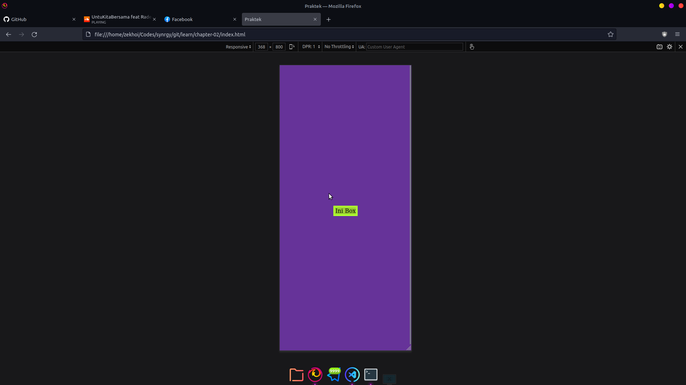
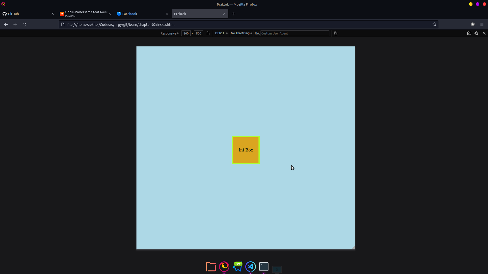
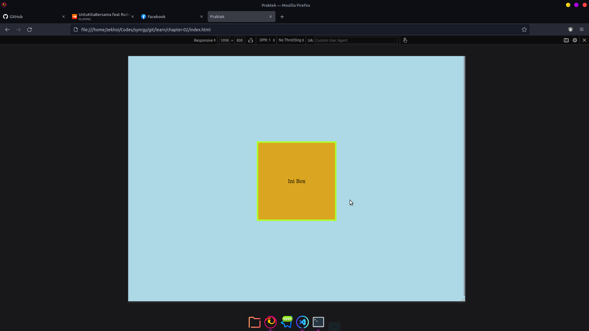
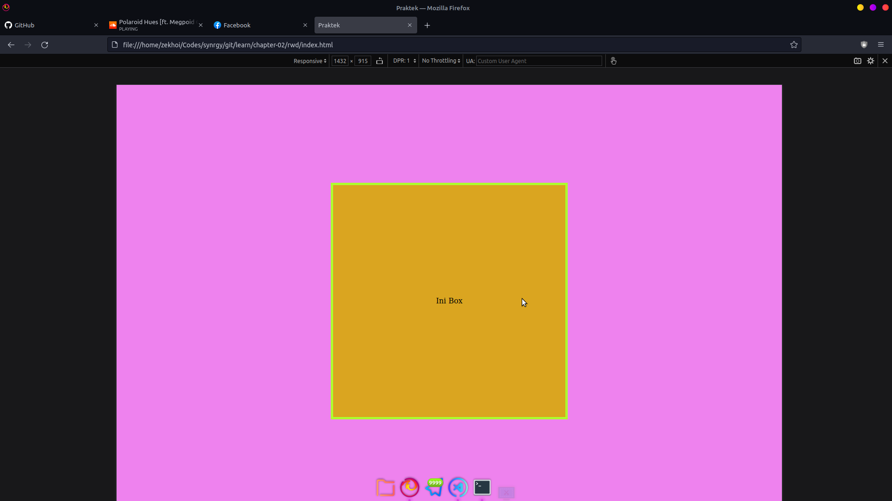
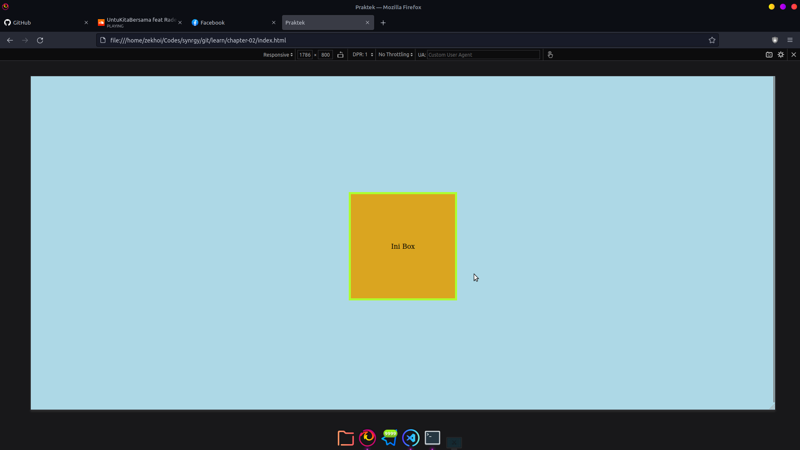

# Responsive Web Design

Bertujuan untuk membuat tampilan yang bagus atau menyesuaikan dengan device yang dipakai oleh user. Styling secara kondisional menyesuaikan ukuran layar.

## Menambahkan viewport pada tag head

```html
<html>
  <head>
    <meta name="viewport" content="width=device-width, initial-scale=1.0" />
  </head>
  <body>
    Dengan viewport
  </body>
</html>
```

## Memakai media query pada CSS

```css
body {
  background-color: rebeccapurple;
}

.box {
  display: flex;
  background-color: yellowgreen;
  justify-content: center;
  align-items: center;
  border: solid 5px greenyellow;
  text-align: center;
}

@media only screen and (min-width: 800px) {
  body {
    background-color: lightblue;
  }

  .box {
    background-color: goldenrod;
    width: 100px;
    height: 100px;
  }
}

@media only screen and (min-width: 1024px) {
  .box {
    width: 250px;
    height: 250px;
  }
}

@media only screen and (min-width: 1280px) and (max-width: 1536px) {
  body {
    background-color: violet;
  }

  .box {
    width: 500px;
    height: 500px;
  }
}
```

Arti dari code di atas, class dengan nama `box` akan berfungsi ketika kondisi

### Kondisi 1

Pada ukuran lebar layar di bawah `800px` class dengan nama `box` akan memiliki `width` dan `height` yang menyesuaikan text dan `background-color` dengan warna `rebeccapurple`.

Code CSS yang berlaku pada ukuran di bawah `800px`:

```css
body {
  background-color: rebeccapurple;
}

.box {
  display: flex;
  background-color: yellowgreen;
  justify-content: center;
  align-items: center;
  border: solid 5px greenyellow;
  text-align: center;
}
```



### Kondisi 2

Pada ukuran lebar layar di atas `800px` class dengan nama `box` akan memiliki `background-color` berwarna `goldenrod`, `width` dengan ukuran `100px` dan `height` dengan ukuran `100px` serta `body` dengan `background-color` berwarna `lightblue`. \*Sebagian kondisi 1 masih berlaku

Code CSS yang berlaku pada ukuran di atas `800px` saat ini menjadi:

```css
body {
  background-color: lightblue;
}

.box {
  display: flex;
  justify-content: center;
  align-items: center;
  border: solid 5px greenyellow;
  text-align: center;
  background-color: goldenrod;
  width: 100px;
  height: 100px;
}
```



### Kondisi 3

Pada ukuran lebar layar di atas `1024px` class dengan nama `box` akan memiliki `background-color` berwarna `goldenrod`, `width` dengan ukuran `250px` dan `height` dengan ukuran `250px` serta `body` dengan `background-color` berwarna `lightblue`.
\*Sebagian kondisi 1 masih berlaku dan hanya berbeda ukuran box dengan kondisi 2

Code CSS yang berlaku di atas `1024px` saat ini menjadi:

```css
body {
  background-color: lightblue;
}

.box {
  display: flex;
  justify-content: center;
  align-items: center;
  border: solid 5px greenyellow;
  text-align: center;
  background-color: goldenrod;
  width: 250px;
  height: 250px;
}
```



### Kondisi 4

Pada ukuran lebar layar di atas `1280px` sampai `1536px` class dengan nama `box` akan memiliki `background-color` berwarna `goldenrod`, `width` dengan ukuran `500px` dan `height` dengan ukuran `500px` serta `body` dengan `background-color` berwarna `violet`.
\*Sebagian kondisi 1 masih berlaku, hanya berbeda pada warna body dan ukuran box dengan kondisi 2

Code CSS yang berlaku di atas `1280px` sampai `1536px` saat ini menjadi:

```css
body {
  background-color: violet;
}

.box {
  display: flex;
  justify-content: center;
  align-items: center;
  border: solid 5px greenyellow;
  text-align: center;
  background-color: goldenrod;
  width: 500px;
  height: 500px;
}
```



Pada ukuran lebar layar di atas `1536px` class dengan nama `box` akan memiliki `background-color` berwarna `goldenrod`, `width` dengan ukuran `250px` dan `height` dengan ukuran `250px` dengan ukuran `500px` serta `body` dengan `background-color` berwarna `lightblue`. \*Kondisi 5 sama dengan kondisi 3

Code CSS yang berlaku dari `1024px` sampai `1280px` dan di atas `1536px` saat ini menjadi:

```css
body {
  background-color: lightblue;
}

.box {
  display: flex;
  justify-content: center;
  align-items: center;
  border: solid 5px greenyellow;
  text-align: center;
  background-color: goldenrod;
  width: 250px;
  height: 250px;
}
```



### Simulasi

Code HTML bisa dilihat di [Contoh](./index.html)
